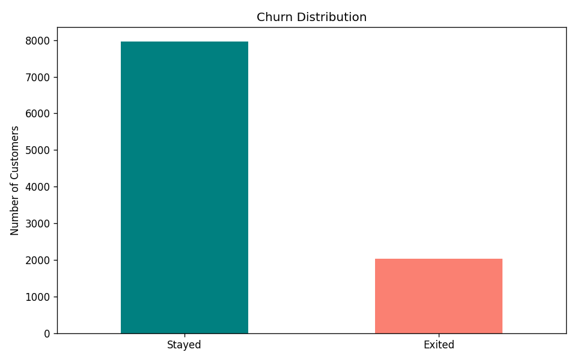
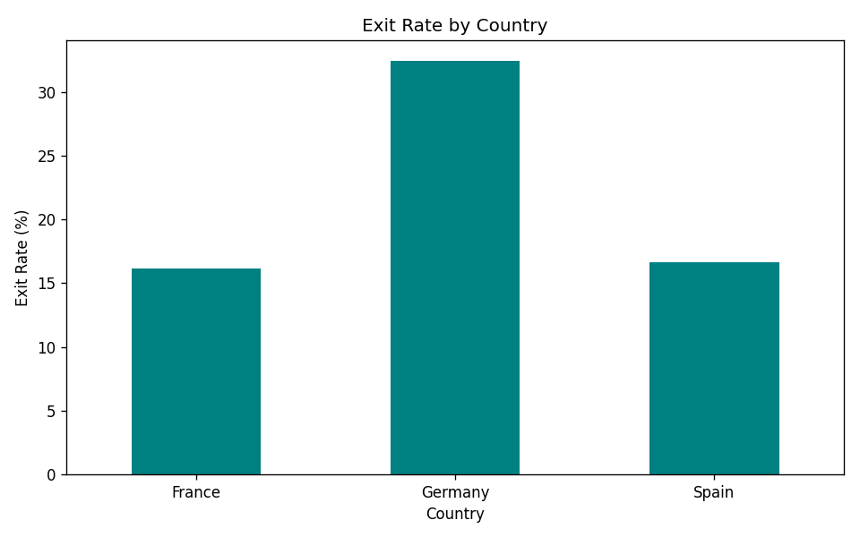
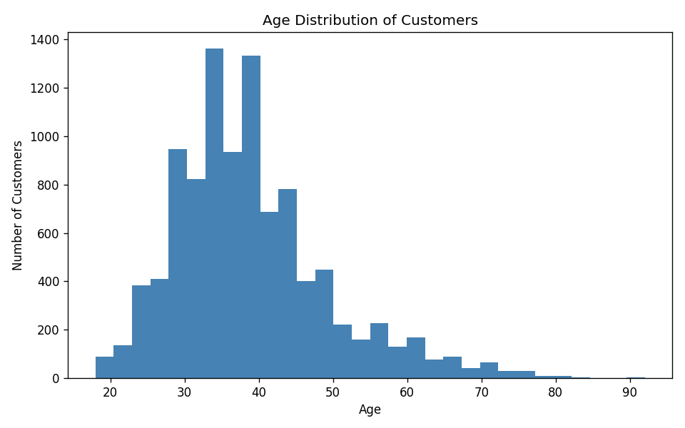
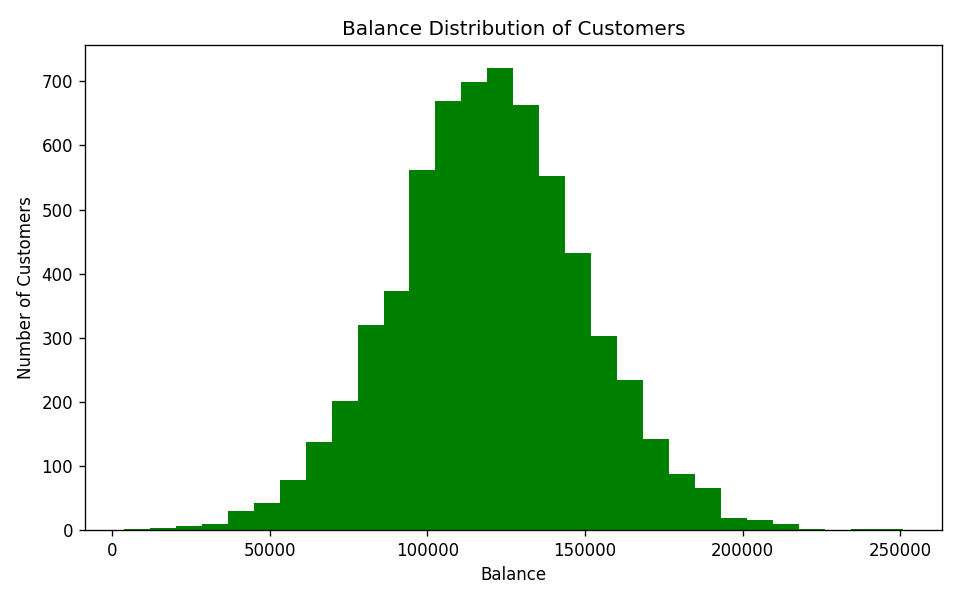
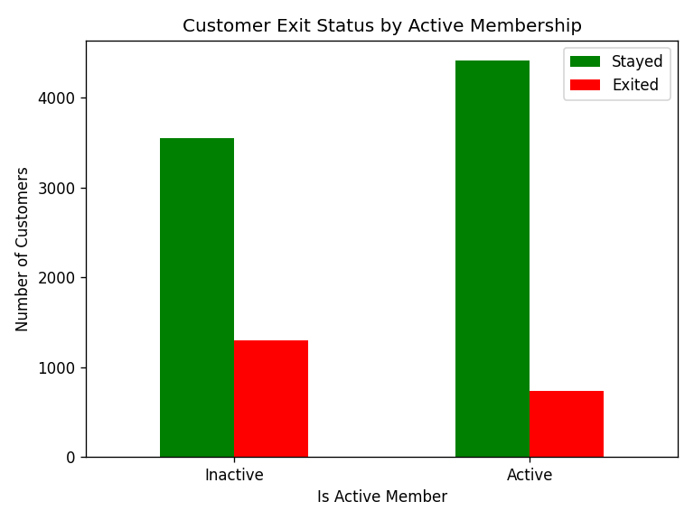
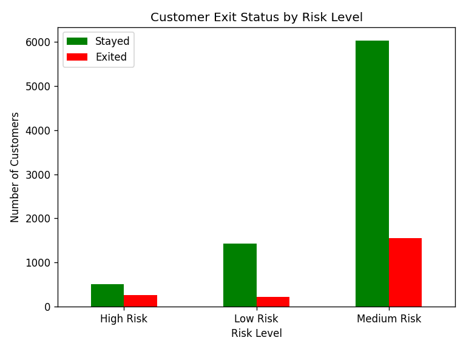

# Bank Customer Churn Analysis

## Overview

This project explores customer churn in a retail banking dataset. The goal was to understand which customers are most likely to leave, and why. I looked at things like geography, account balance, credit score, and activity level to find patterns in the data.

---

## Business Problem

Customer churn is a big deal for banks. When customers leave, it means lost revenue and higher costs to find new ones. By understanding who churns and why, banks can:

- Reach out to at-risk customers before they leave
- Improve retention offers
- Focus resources on the most valuable segments

---

## Dataset

**File:** `data/Churn_Modeling.csv`

The dataset has 10,000 rows of customer data with fields like:

| Column | Description |
|---|---|
| Geography | Country the customer is from |
| Gender | Male / Female |
| Age | Customer age |
| CreditScore | Credit score (350–850) |
| Balance | Account balance |
| IsActiveMember | Whether they're an active member |
| Exited | 1 = churned, 0 = stayed |

---

## Tools Used

- Python
- pandas
- numpy
- matplotlib
- Git / GitHub

---

## Project Structure

```
churn_analysis_project/
├── data/               # Raw dataset
├── notebooks/          # Exploratory analysis notebook
├── outputs/            # Saved chart images
├── src/                # Python modules (loading, cleaning, features, visuals)
├── main.py             # Runs the full pipeline
└── requirements.txt
```

---

## Data Processing

- Removed duplicate rows
- Dropped irrelevant columns (RowNumber, CustomerId, Surname)
- Engineered three new features from existing data

---

## Feature Engineering

I created three new columns to help group customers:

| Feature | Description |
|---|---|
| AgeGroup | Young (≤30), Adult (≤50), Senior (>50) |
| BalanceCategory | No Balance, Low, Medium, High |
| RiskLevel | Low Risk, Medium Risk, High Risk (based on credit score, activity, and balance) |

---

## Visualizations

### Churn Distribution
How many customers stayed vs. left overall.



---

### Exit Rate by Country
Germany had a noticeably higher churn rate compared to France and Spain.



---

### Age Distribution
Most customers are between 30 and 45 years old.



---

### Balance Distribution
Balances are fairly spread out, with a lot of customers clustered around the 100k–150k range.



---

### Activity vs Churn
Inactive members were much more likely to churn than active ones.



---

### Risk Level vs Churn
High and medium risk customers exited at higher rates than low risk customers.



---

## Key Findings

- Overall churn rate was 20.4% — roughly 1 in 5 customers left.
- **Germany** had a churn rate of 32.4%, almost double Spain (16.7%) and France (16.2%).
- **Inactive members** were significantly more likely to churn than active ones.
- Customers with **high balances and low credit scores** were frequently in the high-risk group.

---

## What I Learned

- How to clean and prepare real-world data with pandas
- Feature engineering using NumPy conditions (`np.where`)
- Creating customer segments from raw numeric data
- Building charts with matplotlib
- Structuring a Python project with separate modules
- Version control with Git and GitHub

---

## Future Improvements

- Train a machine learning model to predict churn probability
- Build an interactive dashboard (Tableau or Power BI)
- Add more features like tenure and number of products
